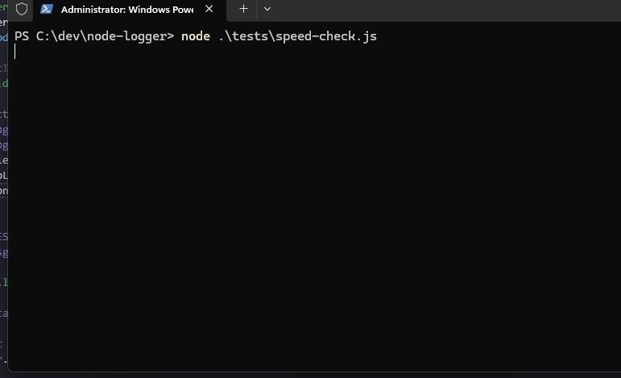

# Node logger

```bash
npm i node-logy
```

A lightweight logger for node js to print to console and also save them to log files auto rotating



# Example


```ts
let logger = new NodeLogger();

logger.info("Hello world", "more", 123);
logger.warn("Hello world");
logger.error(new Error("Yo"), "some other");

await logger.flush()
```


```bash
[2026-02-07T15:33:41.587Z] [INFO]: Performance test log entry number 0
[2026-02-07T15:33:41.588Z] [INFO]: Performance test log entry number 1
[2026-02-07T15:33:41.588Z] [INFO]: Performance test log entry number 2
[2026-02-07T15:33:41.588Z] [INFO]: Performance test log entry number 3
[2026-02-07T15:33:41.588Z] [INFO]: Performance test log entry number 4
[2026-02-07T15:33:41.588Z] [INFO]: Performance test log entry number 5
[2026-02-07T15:33:41.588Z] [INFO]: Performance test log entry number 6
[2026-02-07T15:33:41.588Z] [INFO]: Performance test log entry number 7
[2026-02-07T15:33:41.588Z] [INFO]: Performance test log entry number 8
[2026-02-07T15:33:41.588Z] [INFO]: Performance test log entry number 9
[2026-02-07T15:33:41.588Z] [INFO]: Performance test log entry number 10
[2026-02-07T15:33:41.588Z] [INFO]: Performance test log entry number 11
```


# Performance 


```bash
=== Performance Test: 10,000 Log Lines ===

Total time (fire-and-forget): 32.82ms
Flush time: 8.496ms

=== Results ===
Fire-and-forget loop time: 31.91ms
Flush time:                8.49ms
Total end-to-end time:     40.90ms
Average time per log:      0.004ms
Throughput:                244496 logs/second
Memory used:               0.39 MB
Log file size:             721.57 KB

=== Test Complete ===
```